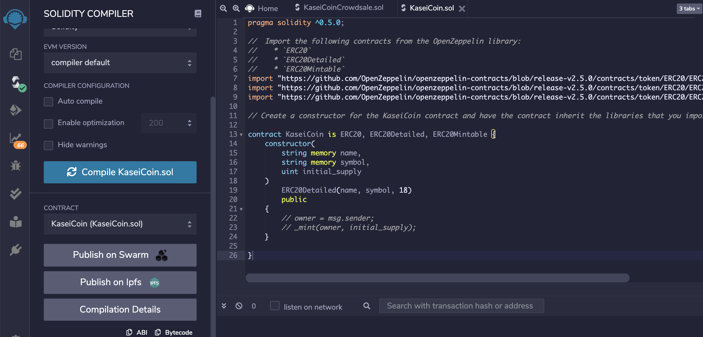
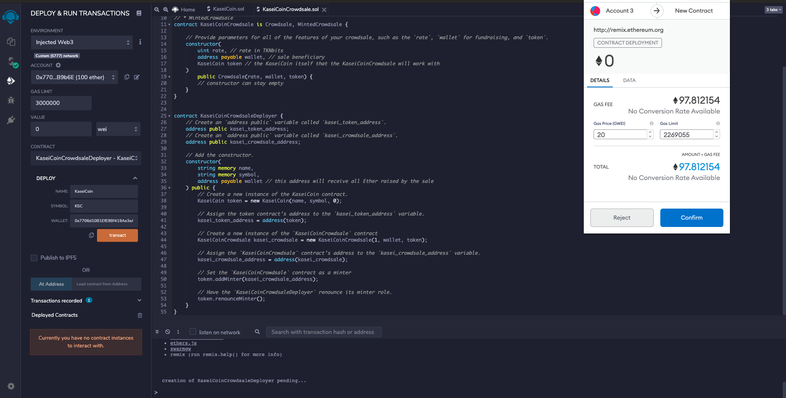

# Application

## Challenge: Martian Token Crowdsale

You will create a fungible token that is ERC-20 compliant and that will be minted by using a `Crowdsale` contract from the OpenZeppelin Solidity library.

The crowdsale contract that you create will manage the entire crowdsale process, allowing users to send ether to the contract and in return receive KAI, or KaseiCoin tokens. Your contract will mint the tokens automatically and distribute them to buyers in one transaction.

### Instructions

The steps for this Challenge are divided into the following sections:

1. Create the KaseiCoin Token Contract

2. Create the KaseiCoin Crowdsale Contract

3. Create the KaseiCoin Deployer Contract

4. Deploy the Crowdsale to a Local Blockchain

## Evaluation Evidence
KaseiCoin Token Contract - Compiled 

KaseiCoin Crowdsale Contract - Compiled

KaseiCoin Crowdsale Deployer - Compiled

